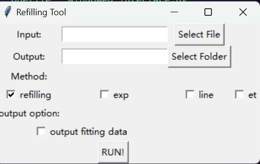

# refilling tools


## 简介

refilling tool是一款北京林业大学PWRLab开发的一款用于植物夜间蒸腾计算的科研软件，原理可以参考PWRLab[研究论文](https://www.plant-ecology.com/CN/10.17521/cjpe.2023.0043)。


## 使用说明

### 使用前必读！！！

- 程序不是万能的，在处理之前请做好数据预处理工作

- 方法本身用于计算典型晴天的液流数据，如果不对数据进行区分请计算完成后详细查验拟合数据确保计算结果质量

### 操作说明

- 使用界面进行操作



> 注：界面的本质其实是通过界面构造cmd命令，代替用户执行指令

- 使用cmd命令行进行操作

在windows cmd中执行refilling.exe会出现一下指令提示界面，按照需要进行选择

```shell
   ___  __    __  __    __    _      ___
  / _ \/ / /\ \ \/__\  / /   /_\    / __\
 / /_)/\ \/  \/ / \// / /   //_\\  /__\//
/ ___/  \  /\  / _  \/ /___/  _  \/ \/  \
\/       \/  \/\/ \_/\____/\_/ \_/\_____/

usage: refilling.exe [-h] [-i INPUT] [-o OUTPUT] [-a] [-r] [-e] [-l] [-t] [-v]

optional arguments:
  -h, --help            show this help message and exit
  -i INPUT, --input INPUT
                        Input Excel file.
  -o OUTPUT, --output OUTPUT
                        Output excel file.
  -a, --all             use origin refilling method.
  -r, --refilling       use origin refilling method.
  -e, --exp             use exp refilling method.
  -l, --line            use line refilling method.
  -t, --et              use extend refilling method.
  -v, --verbose         output verbose refilling information.
```

### 数据格式

为了方便演示软件功能，在软件目录提供了`example.xlsx`作为示范文件

如果自己进行数据构建可以参考下表，表头中时间和太阳辐射相关的表头不可更改，其他样树的表头可以扩充和修改。(表头不可以相同)

| time        | solar_radiation | Tree1     | Tree2      | Tree3 | Tree4      |
| :---        |    :----:   |     :---: | :---:      |    :----:   |   :---: |
| 2024.1.2 3:4| 5 | 0 | 0 | 0 | 0 |
| 2024.1.2 3:5| 6 | 0 | 0 | 0 | 0 |

### 界面操作

界面如下图所示，通过Select File选择需要计算的文件（可以不选择，不选择则计算当前目录下的`example.xlsx`）
通过SelectFolder选择结果文件的输出目录（同样可以不选择，不选择的话存放在程序运行目录）
Method提供了四种方法的输出结果，可以进行勾选，勾选的方法都会在结果excel表格中输出
output fitting data是拟合的中间过程数据，默认不输出，若需要则勾选。（必须选择，没有默认值）


### CMD操作

使用exp进行夜间蒸腾计算

```shell
refilling -r
```

指定输入文件和输出地址，并输出四种结果，并输出拟合过程数据

```shell
refilling -i example.xlsx -o ./ -a -v
```


### 参数配置

运行目录下的json文件提供了方法的参数相关配置，可以根据不同的数据进行调整


```json
// kneed_process仅适用于夜间液流数据质量高的情况，若强行使用自动检测可能导致错误结果
// 如果数据一般，可以通过前10个点的固定方法进行计算
{
    // refilling法：将夜间液流划分为前后半夜，划分的标准是通过拐点确定
    // kneed_process: true/false，当变量为true时，自动检测拐点，当变量为false时使用default_point作为前后半夜划分的点
    // default_point = 30，表示默认夜间开始后30*5min为前后半夜分界
    "refilling": {
        "default_point": 30,
        "kneed_process": false
    },
    // 当kneed_process=false时表示自动检测拐点不开启，
    // default_point= 10，表示默认使用前10个点
    "line": {
        "default_point": 10,
        "kneed_process": false
    },
    // 当kneed_process=false时表示自动检测拐点不开启，
    // default_point = 10，表示默认使用前10个点
    "exp": {
        "default_point": 10,
        "kneed_process": false
    },
    // 当kneed_process=false时表示自动检测拐点不开启，表示默认使用前10个点
    // min_strategy = true/false 表示反推中计算夜间充水的方法，详情见文章
    "et": {
        "default_point": 10,
        "kneed_process": false,
        "min_strategy": true
    }
}
``` 


## 注意事项

- 预处理需要保证：

    1. 严格的数据格式
    1. 数据的完整性，如10天必须为1440条数据
    3. 校准过的太阳辐射
    4. 处理过数据缺失和数据异常的液流数据

- 尤其需要注意的几种情况

    - 数据缺失
        - 数据缺失需要删除或进行填补后再计算
        - 正常数据中缺失一个两个
        - 数据缺失需要把正常采集时间空出来，数据需要补充

    - 异常数据
        - 太阳辐射的异常包括白天有低于5w晚上有高于5w的情况，需要针对该系统进行修正，若缺失，应保证白天大于5w晚上小于5w
        - 液流数据的异常包括异常的数据突变，为了不影响结果，应该手动处理好


<!-- 

```shell
pyinstaller -D --exclude-module pandas.tools --exclude-module numpy.distutils --exclude-module numpy.f2py --exclude-module numpy.matlib main.py
pyinstaller -w --upx-dir="C:\Program Files\upx-4.2.4-win64"
cd dist/main && python interface.py
``` -->